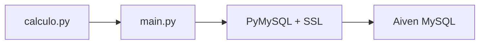

<div align="center">

# Python Cloud Database

Aplicação Python que simula o crescimento de uma população bacteriana e
armazena os resultados em um banco MySQL gerenciado na Aiven.

[](https://github.com/lianeheidemann/python_cloud_database/actions/workflows/python-checks.yml)
[](https://github.com/lianeheidemann/python_cloud_database/actions/workflows/aiven-connection.yml)


</div>

## Visão geral

O projeto demonstra um fluxo completo de integração entre Python e um banco
MySQL em nuvem. A aplicação:

1. calcula uma sequência de crescimento bacteriano;
2. estabelece uma conexão SSL com a Aiven;
3. cria a tabela `minhaTabela`, caso ela ainda não exista;
4. remove os registros da execução anterior;
5. insere a nova sequência;
6. consulta e exibe os valores armazenados.



Com a configuração padrão, a população começa em `5` e dobra durante dez
períodos:

```text
[5, 10, 20, 40, 80, 160, 320, 640, 1280, 2560]
```

## Funcionalidades

- geração determinística dos dados de crescimento;
- validação de população inicial e quantidade de períodos;
- configuração por variáveis de ambiente;
- conexão MySQL com verificação SSL pelo certificado CA;
- criação automática da tabela e de sua chave primária;
- inserção parametrizada para evitar interpolação insegura de valores;
- consulta ordenada dos registros;
- rollback em falhas de escrita;
- teste real de conexão com `SELECT 1`;
- teste real de criação, inserção, consulta e exclusão na Aiven;
- limpeza automática dos recursos temporários criados pelos testes;
- verificação automática de sintaxe com GitHub Actions.

## Tecnologias

| Tecnologia | Finalidade |
| --- | --- |
| Python 3.13 | Lógica da aplicação e dos testes |
| MySQL 8.4 | Armazenamento relacional |
| Aiven | Hospedagem gerenciada do MySQL |
| PyMySQL | Driver de conexão com o banco |
| python-dotenv | Leitura das variáveis do arquivo `.env` |
| cryptography | Suporte à autenticação segura do driver |
| pytest | Testes automatizados |
| GitHub Actions | Integração contínua e testes manuais na nuvem |

## Modelo de dados

A aplicação cria a tabela principal com a seguinte estrutura:

```sql
CREATE TABLE IF NOT EXISTS minhaTabela (
    id BIGINT UNSIGNED NOT NULL AUTO_INCREMENT,
    valores BIGINT NOT NULL,
    PRIMARY KEY (id)
);
```

| Coluna | Tipo | Descrição |
| --- | --- | --- |
| `id` | `BIGINT UNSIGNED` | Identificador único e auto-incrementável |
| `valores` | `BIGINT` | População calculada em cada período |

## Estrutura do projeto

```text
python_cloud_database/
├── .github/
│   └── workflows/
│       ├── aiven-connection.yml      # testes reais e manuais na Aiven
│       └── python-checks.yml         # verificação automática de sintaxe
├── docs/
│   └── configuracao_mysql.md         # configuração da Aiven e do Workbench
├── tests/
│   ├── test_aiven_connection.py      # teste SSL com SELECT 1
│   └── test_aiven_crud.py            # teste CRUD em tabela temporária
├── .env.example                      # modelo das variáveis de ambiente
├── .gitignore                        # arquivos ignorados pelo Git
├── ca.pem                            # certificado CA da Aiven
├── calculo.py                        # cálculo do crescimento bacteriano
├── main.py                           # conexão e operações no MySQL
├── requirements.txt                   # dependências com versões fixadas
├── README.md                         # documentação atual
└── readme_v2.md                      # documentação ampliada
```

## Pré-requisitos

- Python 3.13 ou versão compatível;
- Git;
- serviço MySQL ativo na Aiven;
- certificado CA fornecido pela Aiven;
- MySQL Workbench, opcionalmente, para consultas gráficas.

Não é necessário instalar ou executar um servidor MySQL local.

## Instalação

### 1. Clone o repositório

```bash
git clone https://github.com/lianeheidemann/python_cloud_database.git
cd python_cloud_database
```

### 2. Crie o ambiente virtual

```bash
python -m venv .venv
```

Ative o ambiente no Windows PowerShell:

```powershell
.\.venv\Scripts\Activate.ps1
```

No Linux ou macOS:

```bash
source .venv/bin/activate
```

### 3. Instale as dependências

```bash
python -m pip install --upgrade pip
python -m pip install -r requirements.txt
```

## Configuração da Aiven

No painel da Aiven, abra o serviço MySQL e copie os dados apresentados em
**Connection information**. Baixe também o **CA Certificate**.

Crie o arquivo `.env` a partir do modelo:

```powershell
Copy-Item .env.example .env
```

No Linux ou macOS:

```bash
cp .env.example .env
```

Preencha o `.env`:

```env
DB_HOST=host-fornecido-pela-aiven
DB_PORT=porta-fornecida-pela-aiven
DB_USER=usuario-fornecido-pela-aiven
DB_PASSWORD="senha-fornecida-pela-aiven"
DB_NAME=defaultdb
DB_SSL_CA=ca.pem
```

Salve o certificado da Aiven como `ca.pem` na raiz do projeto. Consulte o
[guia detalhado de configuração](docs/configuracao_mysql.md) para configurar
também o MySQL Workbench.

## Execução

Com o ambiente virtual ativo e o `.env` configurado:

```bash
python main.py
```

Saída resumida:

```text
Lista gerada:
[5, 10, 20, 40, 80, 160, 320, 640, 1280, 2560]

Tamanho da lista: 10
Tabela verificada com sucesso!
Tabela limpa com sucesso!
```

Para consultar os registros no MySQL Workbench:

```sql
SELECT *
FROM defaultdb.minhaTabela
ORDER BY id;
```

## Testes

### Testes locais

Os testes usam uma conexão real com a Aiven. Configure o `.env` e execute:

```bash
python -m pytest -q -s tests
```

O primeiro teste valida a conexão SSL com `SELECT 1`. O segundo cria uma tabela
com nome aleatório, insere e consulta um registro, exclui esse registro e remove
a tabela no bloco `finally`.

Saída esperada:

```text
Tabela criada: github_actions_test_...
Registro consultado: ('teste-crud-github-actions',)
Registros após a exclusão: 0
2 passed
```

Os testes não modificam a tabela principal `minhaTabela`.

### GitHub Actions

| Workflow | Acionamento | Verificação |
| --- | --- | --- |
| `python-checks.yml` | Push, pull request ou execução manual | Compila `main.py` e `calculo.py` para detectar erros de sintaxe |
| `aiven-connection.yml` | Execução manual | Executa os testes reais de conexão e CRUD na Aiven |

Para executar o teste da Aiven:

1. abra a aba **Actions**;
2. selecione **Teste de conexão Aiven**;
3. clique em **Run workflow**;
4. escolha a branch `main`;
5. confirme a execução.

O workflow utiliza estes **Repository Secrets**:

| Secret | Conteúdo esperado |
| --- | --- |
| `AIVEN_DB_HOST` | Host do serviço |
| `AIVEN_DB_PORT` | Porta do serviço |
| `AIVEN_DB_USER` | Usuário do banco |
| `AIVEN_DB_PASSWORD` | Senha do banco |
| `AIVEN_DB_NAME` | Nome do banco, normalmente `defaultdb` |

O caminho `DB_SSL_CA: ca.pem` é definido no YAML porque identifica um arquivo,
não uma credencial secreta.

## Segurança

- nunca publique o `.env`, a senha ou a Service URI;
- mantenha somente valores ilustrativos no `.env.example`;
- armazene credenciais de automação em GitHub Secrets;
- utilize o certificado CA para validar a identidade do servidor;
- altere imediatamente qualquer credencial exposta;
- não grave senhas diretamente no código ou no workflow.

> [!WARNING]
> A execução de `main.py` chama `TRUNCATE TABLE minhaTabela` antes de inserir a
> nova sequência. Isso remove todos os registros anteriores da tabela principal.

## Solução de problemas

O guia [Configuração do MySQL na Aiven](docs/configuracao_mysql.md) reúne
instruções para:

- configurar SSL;
- conectar pelo MySQL Workbench;
- corrigir `Access denied`;
- identificar uma conexão acidental com o MySQL local;
- resolver erros relacionados ao certificado ou à chave primária.

## Melhorias futuras

- criar testes unitários para `calculo.py`;
- validar as variáveis de ambiente antes da conexão;
- substituir os `print()` por logs estruturados;
- inserir listas de valores em uma única transação;
- adicionar relatório de cobertura de testes.

