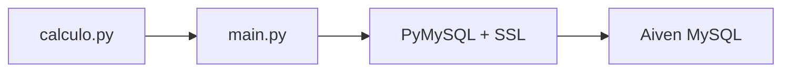

<div align="center">

# Python Cloud Database

A Python application that simulates bacterial population growth and stores the results in a managed MySQL database on Aiven.

[](https://github.com/lianeheidemann/python-cloud-database/actions/workflows/python-checks.yml)
[](https://github.com/lianeheidemann/python-cloud-database/actions/workflows/aiven-connection.yml)


</div>

## Overview

This project demonstrates a complete integration flow between Python and a cloud-hosted MySQL database. The application:

1. Calculates a bacterial growth sequence.
2. Establishes an SSL connection to Aiven.
3. Creates the `minhaTabela` table if it does not exist.
4. Removes records from the previous run.
5. Inserts the new sequence.
6. Retrieves and displays the stored values.



With the default configuration, the population starts at `5` and doubles over ten periods:

```text
[5, 10, 20, 40, 80, 160, 320, 640, 1280, 2560]
```

## Features

- Deterministic bacterial-growth data generation
- Validation of the initial population and number of periods
- Environment-based configuration
- Verified SSL connection through a CA certificate
- Automatic table and primary-key creation
- Parameterized inserts to avoid unsafe value interpolation
- Ordered record retrieval
- Rollback after write failures
- Real connection test with `SELECT 1`
- Real create, insert, read, and delete test on Aiven
- Automatic cleanup of temporary test resources
- Automated syntax validation with GitHub Actions

## Technologies

| Technology | Purpose |
|---|---|
| Python 3.13 | Application and test logic |
| MySQL 8.4 | Relational data storage |
| Aiven | Managed MySQL hosting |
| PyMySQL | Database connection driver |
| python-dotenv | Loading variables from `.env` |
| cryptography | Secure driver authentication support |
| pytest | Automated testing |
| GitHub Actions | Continuous integration and manual cloud tests |

## Data Model

The application creates the main table with the following structure:

```sql
CREATE TABLE IF NOT EXISTS minhaTabela (
    id BIGINT UNSIGNED NOT NULL AUTO_INCREMENT,
    valores BIGINT NOT NULL,
    PRIMARY KEY (id)
);
```

| Column | Type | Description |
|---|---|---|
| `id` | `BIGINT UNSIGNED` | Unique auto-incrementing identifier |
| `valores` | `BIGINT` | Population calculated for each period |

## Project Structure

```text
python-cloud-database/
├── .github/
│   └── workflows/
│       ├── aiven-connection.yml      # real, manually triggered Aiven tests
│       └── python-checks.yml         # automated syntax checks
├── docs/
│   ├── archive/                      # previous README versions
│   └── configuracao_mysql.md         # Aiven and Workbench setup
├── tests/
│   ├── test_aiven_connection.py      # SSL test using SELECT 1
│   └── test_aiven_crud.py            # CRUD test using a temporary table
├── .env.example                      # environment-variable template
├── .gitignore                        # ignored files
├── ca.pem                            # Aiven CA certificate
├── calculo.py                        # bacterial-growth calculation
├── LICENSE                           # MIT License
├── main.py                           # MySQL connection and operations
├── requirements.txt                  # pinned dependencies
└── README.md                         # current documentation
```

## Prerequisites

- Python 3.13 or a compatible version
- Git
- An active MySQL service on Aiven
- The CA certificate supplied by Aiven
- Optionally, MySQL Workbench for graphical queries

A local MySQL server is not required.

## Installation

### 1. Clone the Repository

```bash
git clone https://github.com/lianeheidemann/python-cloud-database.git
cd python-cloud-database
```

### 2. Create a Virtual Environment

```bash
python -m venv .venv
```

Activate it on Windows PowerShell:

```powershell
.\.venv\Scripts\Activate.ps1
```

On Linux or macOS:

```bash
source .venv/bin/activate
```

### 3. Install Dependencies

```bash
python -m pip install --upgrade pip
python -m pip install -r requirements.txt
```

## Aiven Configuration

In the Aiven console, open your MySQL service and copy the values under **Connection information**. Download the **CA Certificate** as well.

Create `.env` from the template:

```powershell
Copy-Item .env.example .env
```

On Linux or macOS:

```bash
cp .env.example .env
```

Fill in the environment variables:

```env
DB_HOST=host-provided-by-aiven
DB_PORT=port-provided-by-aiven
DB_USER=user-provided-by-aiven
DB_PASSWORD="password-provided-by-aiven"
DB_NAME=defaultdb
DB_SSL_CA=ca.pem
```

Save the Aiven certificate as `ca.pem` in the project root. See the [detailed MySQL configuration guide](docs/configuracao_mysql.md) for MySQL Workbench setup.

## Running the Application

With the virtual environment active and `.env` configured:

```bash
python main.py
```

Example output:

```text
Generated list:
[5, 10, 20, 40, 80, 160, 320, 640, 1280, 2560]

List length: 10
Table verified successfully!
Table cleared successfully!
```

To query records in MySQL Workbench:

```sql
SELECT *
FROM defaultdb.minhaTabela
ORDER BY id;
```

## Tests

### Local Tests

The tests use a real Aiven connection. Configure `.env` and run:

```bash
python -m pytest -q -s tests
```

The first test validates the SSL connection with `SELECT 1`. The second creates a randomly named table, inserts and retrieves a record, deletes the record, and removes the table in a `finally` block.

Expected output:

```text
Table created: github_actions_test_...
Record retrieved: ('teste-crud-github-actions',)
Records after deletion: 0
2 passed
```

The tests do not modify the main `minhaTabela` table.

### GitHub Actions

| Workflow | Trigger | Validation |
|---|---|---|
| `python-checks.yml` | Push, pull request, or manual run | Compiles `main.py` and `calculo.py` to detect syntax errors |
| `aiven-connection.yml` | Manual run | Executes real connection and CRUD tests on Aiven |

> **Note:** because this workflow only runs on manual trigger (`workflow_dispatch`), the badge above reflects the result of the *last manual run*, not the current state of the code. A red badge may indicate that the free Aiven service expired from inactivity rather than a code failure. Re-run the workflow after confirming the Aiven service is active to get an up-to-date result. The full run history remains available in the repository's **Actions** tab.

To run the Aiven tests:

1. Open the **Actions** tab.
2. Select **Aiven connection test**.
3. Click **Run workflow**.
4. Select the `main` branch.
5. Confirm the run.

The workflow uses these repository secrets:

| Secret | Expected value |
|---|---|
| `AIVEN_DB_HOST` | Service host |
| `AIVEN_DB_PORT` | Service port |
| `AIVEN_DB_USER` | Database user |
| `AIVEN_DB_PASSWORD` | Database password |
| `AIVEN_DB_NAME` | Database name, usually `defaultdb` |

The `DB_SSL_CA: ca.pem` path is defined directly in the workflow because it identifies a file, not a secret credential.

## Security

- Never publish `.env`, a database password, or the service URI.
- Keep only illustrative values in `.env.example`.
- Store automation credentials in GitHub Secrets.
- Use the CA certificate to verify the server identity.
- Rotate any exposed credential immediately.
- Never hard-code passwords in source code or workflows.

> [!WARNING]
> Running `main.py` calls `TRUNCATE TABLE minhaTabela` before inserting the new sequence. This deletes all existing records from the main table.

## Troubleshooting

The [Aiven MySQL configuration guide](docs/configuracao_mysql.md) covers:

- SSL configuration
- MySQL Workbench connections
- `Access denied` errors
- Accidental connections to a local MySQL server
- Certificate and primary-key issues

## Future Improvements

- Add unit tests for `calculo.py`
- Validate environment variables before connecting
- Replace `print()` calls with structured logging
- Insert value lists in a single transaction
- Add a test-coverage report

---

<p align="center">Developed by <strong>Liane Heidemann</strong></p>
